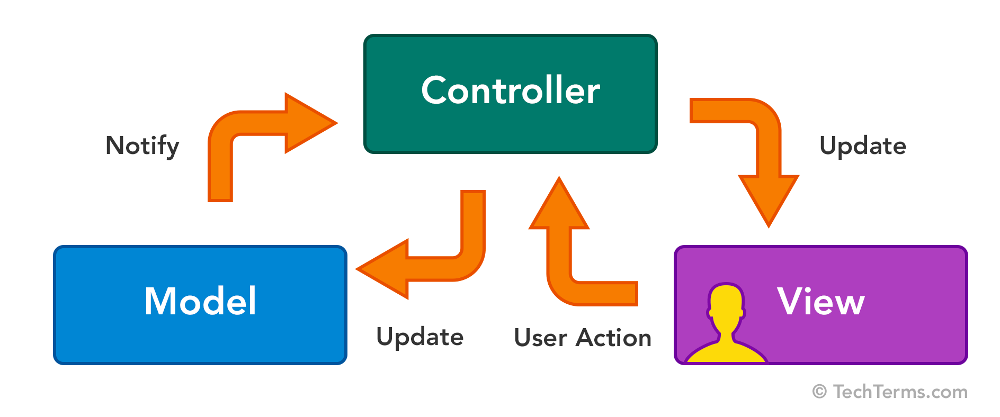
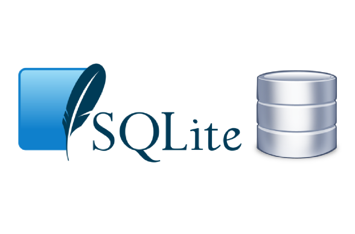
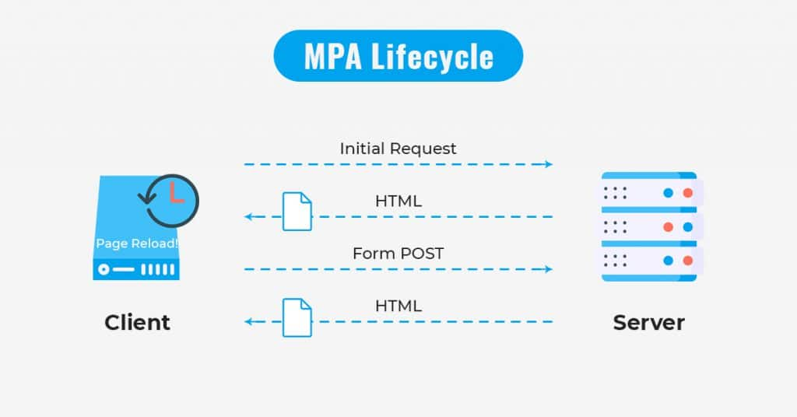
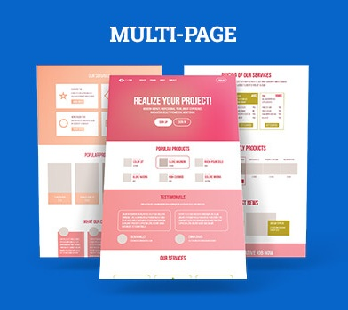

---
# You can also start simply with 'default'
theme: seriph
# random image from a curated Unsplash collection by Anthony
# like them? see https://unsplash.com/collections/94734566/slidev
layout: image
image: /assets/img/background.jpg
backgroundSize: cover
# some information about your slides (markdown enabled)
title: Discord bot és log program
# apply unocss classes to the current slide
class: text-center
# https://sli.dev/features/drawing
drawings:
  persist: false
# slide transition: https://sli.dev/guide/animations.html#slide-transitions
transition: slide-left
# enable MDC Syntax: https://sli.dev/features/mdc
mdc: true
---

<div class="mt-5">
  <h1 style="color: white">Naplózás discord bottal - Milyen technológiák szükségesek ehhez?</h1>
</div>

<div @click="$slidev.nav.next" class="mt-55 py-1" hover:bg="white op-10">
  Mi fán terem a bot, és egyáltalán... <carbon:arrow-right />
</div>

<div class="abs-br m-6 text-xl">
  <button @click="$slidev.nav.openInEditor" title="Open in Editor" class="slidev-icon-btn">
    <carbon:edit />
  </button>
  <a href="https://github.com/szankdav/SVSimulator-chatbot" target="_blank" class="slidev-icon-btn">
    <carbon:logo-github />
  </a>
</div>

<!--
FELVÉTEL! KÖSZÖNET MINDENKINEK!
Mondjuk azt, hogy feltörekvő fejlesztők vagyok, ami igaz is, és kaptok egy megbízást valakitől, hogy szeretnék naplózni a 
discord szerverükön elküldött üzeneteket. Ezt természetesen, mint a fejlesztésben nagyon sok mindent, nagyon sok féleképpen
meg lehetne oldani. Én most azt szeretném nektek bemutatni, hogy a kivitelézhez milyen technológiákat, és megközelítéseket használtam,
amikkel egyszerűen kivitelezhető egy ilyen igény.
-->

---
transition: fade-out
---

## Mit fogunk ma tanulni?

<p v-click>Felhasznált technológiák:</p>

<ul>
  <li v-click>Discord bot</li>
  <li v-click>MVC (model-view-controller) programtervezési minta</li>
  <li v-click>SQLite3</li>
  <li v-click>MPA (multi page application)</li>
</ul>

<p v-click>Ma ezt a tudást szeretném veletek megosztani!</p>

<div class="flex">
<div @click="$slidev.nav.next" class="mt-15 py-1 text-center">
  <p v-click hover:bg="white op-10">Induljunk, csak nehogy megBOToljunk <carbon:arrow-right /></p>
  </div>
  </img>
</div>

<!--
Én megkaptam azt a feladatot, hogy az imént felvázolt igényt kielégítsem, így létrehoztam ehhez egy projektet.
Természetesen ez a projekt tanulási céllal jött létre, melynek megvalósítása során megismerkedtem különböző techekkel, 

KLIKK!

többek között a discord botok hátterével, azok felépítésével és működési logikájával. Megtanultam mi az az MVC pattern (model-view-controller programtervezési minta), amit követtem a naplózó program létrehozása során. Az üzeneteket SQLite3 adatbázisba tárolom, és MPA (multi page applictaion) megközelítéssel jelenítem meg.

Az előadás során szeretném veletek is megosztani, hogy miket tanultam ezen témák feldolgozása során, és reményeim szerint ezt olyan módon teszem meg, hogy a végére ti ugyan annyit fogtok tudni belőlük, mint én.

Nektek is lesz feladatotok, elsősörban az, hogy jelezzétek felém, ha túl gyorsan haladok, túl halk vagyok, túl hangos vagyok, bármi hasonló,
és természetesen bármikor van bármi kérdésetek, azt akár bekiabálós jelleggel tegyétek fel! Célunk az, hogy tanuljunk!
-->

---
transition: slide-up
---

<div>
  <h1 style="color: white">Mi a Discord</h1>
</div>


<ul>
  <li v-click>Szerverek és csatornák</li>
  <li v-click>Hang- és videóhívások</li>
  <li v-click>Botok és automatizáció</li>
  <li v-click>Integráció más alkalmazásokkal</li>
  <li v-click>Biztonsági és jogosultsági rendszer</li>
  <li v-click>Platformfüggetlenség</li>
</ul>

<p v-click>A Discord egy ingyenes, platformfüggetlen kommunikációs alkalmazás.</p>

<div v-click @click="$slidev.nav.next" class="mt-12 py-1 text-center" hover:bg="white op-10">
  Mik is azok a botok <carbon:arrow-right />
</div>

<style>
  .slidev-vclick-hidden {
  display: none;
}
</style>

<!--
Bár tudom, hogy mindannyian ismeritek a Discordot, hiszen most is ezt használjuk, és ennek segítségével tartom nektek ezt az előadást, pár szót ejtsünk róla.

A Discord egy ingyenes, platformfüggetlen kommunikációs alkalmazás, amelyet elsősorban játékosok és közösségek számára fejlesztettek ki, de mára széles körben használják cégek, oktatási intézmények és baráti társaságok is. A program lehetővé teszi a felhasználók számára, hogy szöveges, hang- és videóbeszélgetéseket folytassanak, valamint fájlokat osszanak meg és élő közvetítéseket tartsanak.

KLIKK!

Főbb jellemzői:

Szerverek és csatornák: A Discord szerverekre épül, amelyekben különböző tematikus csatornák hozhatók létre (pl. szöveges, hangalapú vagy privát csatornák).

Hang- és videóhívások: Kiváló minőségű hang- és videóhívások támogatása, valamint képernyőmegosztási lehetőség.

Botok és automatizáció: A felhasználók botokat adhatnak a szerverekhez, amelyek automatikusan végrehajthatnak különböző feladatokat, például moderálást, játékokat vagy információs szolgáltatásokat, és ezen kívül kicsit bátran kijelentve, szinte bármit, amit képesek vagyunk belekódolni.

Integráció más alkalmazásokkal: Összekapcsolható Twitch-csel, YouTube-bal, Spotify-jal és más platformokkal.

Biztonsági és jogosultsági rendszer: Részletes szerepkör- és jogosultságkezelés biztosítja a szerverek biztonságát és személyre szabhatóságát.

Platformfüggetlenség: Elérhető Windows, macOS, Linux, Android és iOS rendszereken, valamint böngészőből is használható.

Mivel a Discord különösen népszerű a gamerek és fejlesztői közösségek körében, de egyre több vállalkozás és oktatási intézmény is használja az egyszerű és gyors kommunikáció érdekében, evidens volt, hogy erre essen a választás, amikor kitaláltuk ezt a tanuló projektet. 

Így, hogy tudjuk, mi az a discord, és hogyan kapcsolódnak hozzá a botok, térjünk ét arra, hogy: 
-->

---

</img>

<h2 v-click>Jellemzőik</h2>

<ul class="mt-5">
  <li v-click>Automatizáció</li>
  <li v-click>Interaktivitás</li>
  <li v-click>Moduláris felépítés</li>
  <li v-click>Könnyen konfigurálható</li>
  <li v-click>Biztonságos hozzáférés</li>
</ul>

<div v-click @click="$slidev.nav.next" class="mt-12 py-1 text-center" hover:bg="white op-10">
  Hogyan képes erre? <carbon:arrow-right />
</div>

<style>
  .slidev-vclick-hidden {
  display: none;
}
</style>

<!--
A Discord botok olyan automatizált programok, amelyek a Discord API segítségével működnek, és különböző feladatokat látnak el egy szerveren. Ezek lehetnek egyszerű, egyfunkciós botok vagy összetett rendszerek, amelyek többféle interakciót és szolgáltatást biztosítanak a felhasználók számára.
Tehát mik is jellemzik őket?

KLIKK!

Mik jellemzik a botokat

Automatizáció – Feladatokat hajtanak végre emberi beavatkozás nélkül, például üdvözlő üzenetek küldése vagy moderáció.
Illetve automatizálhatunk velük szinte bármit, csak tudjuk megvalósítani. 

Interaktivitás – Reagálnak a felhasználói parancsokra, gombokra, menükre, üzenetekre és egyéb Discord-eseményekre.

Moduláris felépítés – Különböző funkciókkal bővíthetők (pl. zenelejátszás, statisztikák, időzített események). Doksi!

Könnyen konfigurálható – API-n keresztül módosíthatók a beállítások és a működés. Discord Developer portal!

Biztonságos hozzáférés – Jogosultságkezeléssel szabályozható, hogy milyen műveleteket végezhet el a bot.
-->

---


<div class="flex">
<div v-click @click="$slidev.nav.next" class="ml-65 py-1">
  <p hover:bg="white op-10">Nézzünk meg, hogyan jön létre egy bot <carbon:arrow-right /></p>
</div>
</div>

<!--
Ez ennyire nincsen elkülönülve egymástól, mint ahogy a képen látható. A botunkat valahol üzemeltetni kell, tehát futnia kell valahol, ez lehet a mi számítógépünk, vagy lehet egy felhő alapú hosting szolgáltatás. A botunkkat hozzá kell adni a kívánt discord szerverhez, így amikor a discord szerveren egy bottal kapcsolatos interakció történik, a bot kódja lesz az, ahol a megfelelő válasz interakció futtatásra kerül. 

Pl. ha én elküldök egy üzenetet a discord szerveren, és a bot erre fel van készítve, tehát belekódoltuk, hogy figyelje a szerverünkön az üzenetet létrejöttét, akkor az eseményhez rendelt megfelelő kódsor fog lefutni a bot kódjában. Spoiler veszély, mi pont ezt tettük, de ne szaladjunk előre.
-->

---

<div>
Egy egyszerű bot létrehozásának lépései Node.js és discord.js használatával:
</div>

<div class="mt-10" v-click>
```ts
import { Client, GatewayIntentBits } from "discord.js";
```
</div>
<div v-click>
```ts
const client = new Client({
  intents: [GatewayIntentBits.Guilds, GatewayIntentBits.GuildMessages],
});
```
</div>
<div v-click>
```ts
client.once("ready", () => {
  console.log(`Bot bejelentkezve: ${client.user?.tag}`);
});
```
</div>
<div v-click>
```ts
client.login("YOUR_DISCORD_BOT_TOKEN");
```
</div>

<div v-click @click="$slidev.nav.next" class="ml-90 mt-15 py-1">
  <p hover:bg="white op-10">Konfiguráljuk <carbon:arrow-right /></p>
</div>

<!-- 
Ami fontos:

A Discord developer portalon létrehozunk egy saját fiókot, majd egy új applikációt, amit hozzáadunk a szerverünkhöz. Ezeket a lépéseket itt most csak nagyjából fogom bemutatni, nagyon jól vannak dokumentálva a discord.js oldalán.
A prezentáció végén minden linkket be fogok másolni az svsimulator szerverére!

https://discordjs.guide/preparations/setting-up-a-bot-application.html#creating-your-bot

Mi itt most a bot kódbeli felépítését fogjuk megvizsgálni.

Ha ezeket a lépéseket megtettük, akkor meglesz a "kapcsolónk" a botunk, és a Discord API között.

A Discord botokat általában Node.js és a discord.js könyvtár segítségével fejlesztik, de más nyelvekkel (pl. Python, Java, C#) is létrehozhatók. 

Én Node.js-t és discord.js-t használtam, úgyhogy lássuk, hogy néznek ki egy egyszerű bot létrehozásának lépései:

1. Feltepítjük a discord.js könyvtárat a projektünkhöz majd beimportáljuk

2. Létrehozunk egy kliens példányt a botunk számára

Az intents szándékokat jelent. Itt határozzuk meg, hogy a botnak mihez lesz hozzáférésre. Ha innen kihagyunk valamit, amivel viszont a későbbiekben dolgozni szeretnénk, akkor hibát fogunk kapni.

3. A client.once ahogy a neve is sugallja, figyelni fogja egyszer, hogy a "ready" esemény bekövetkezett-e. Amennyiben igen, visszajelzésként kiírjuk a konzolra, hogy a bot sikeresen bejelentkezett.

4. A botunk token-ével bejelentkezünk. Ezzel a bejelentkezéssel érjük el, hogy a discordon a botunk aktív állapotba kerüljön. Ez azzal egyenértékű, mint amikor mi bejelentkezünk a discordba a gépünkön. Nekünk már fel sem tűnik, hiszen mindig be vagyunk lépve, de amikor reggel bekapcsoljátok a gépet, ez a login megtörténik a mi fiókunkkal is.
Ez az a token, amit a discord developer portálon lesz látható.

És viola! Ha futtatjuk ezt a kódot egy szerveren, akár a gépünkön, lokálisan, van is egy aktív botunk a discord szerverünkön!

Na de mit tud?

-->

---

<h2>A konfigurálás</h2>

<div class="mt-5" v-click>
Interakcióra történő feliratkozás:
```ts
client.on("interactionCreate", async (interaction) => {
  console.log(interaction);
});
```
</div>

<div class="mt-5" v-click>
Üzenetküldésre történő feliratkozás:
```ts
client.on("messageCreate", async (interaction) => {
  console.log(interaction);
});
```
</div>

<div class="mt-5" v-click>
Írjuk ki ki írta az üzenetet:
```ts
client.on("messageCreate", async (interaction) => {
  console.log(interaction.user.username);
});
```
</div>

<div v-click @click="$slidev.nav.next" class="ml-90 py-1">
  <p hover:bg="white op-10">A naplózás <carbon:arrow-right /></p>
</div>

<!-- 
Szót ejtettem arról, hogy nagyon könnyen konfigurálható a bot, és ez igaz is. 

A botunk elsősorban eseményekkel dolgozik. Számos eseményre képes feliratkozni a bot, a teljes listát megtaláljátok az oldalon, amit korábban linkeltem. A legtöbbet használt események azonban az interakciók:

Interakciónak számít az, ha a bottal közvetlenül lépnük kapcsolatba, mondjuk kiadunk neki egy slash parancsot. Biztos használtatok már ilyet, ha a / jelet beírjátok egy szerveren, ahol be van jelentkezve egy bot, akkor megjelennek az elérhető interakciók. Az interactionCreate jelen esetben egy esemény, amire a bot feliratkozik. Mikor mi interakcióba lépünk a bottal, ezt az eseményt fogja a szerveren történő interakciónk kiváltani.

A bot képes arra, hogy a szerveren különböző eseményeket figyeljen. Üzenet küldés, megemlítés, szavazás indítás, új csatorna létrehozás, és sorolhatnám. Ami a lényeges a fejlesztők, vagyis a mi szempontunkból, hogy mi mit szeretnénk akkor, ha ezek az események létrejönnek. Az üzenetküldés esemény esetén nem szükséges közvetlenül interakciót indítanunk a bottal. Az esemény létre fog jönni, mikor egy üzenet elküldésre kerül a discord szerveren. Amikor elküldjük az üzenetet, az esemény ki fogja váltani az itt található kód futását.

A paraméternek kapott interakció tartalmazni fog mindent, ami discord szerver interakciójával kapcsolatos.

Itt a console.log-ok helyett bármi történhet. Létrejön egy esemény, és szeretnénk kiírni, hogy ki indította? Oké, írjuk ki a consol-ra. Amire szeretnék itt rámutatni, hogy a bot létrehozása ebből a pár egyszerű lépésből áll. Hogy utána mihez kezdünk a bottal, már a mi igényeink kérdése.

Mi elsősorban naplózni szeretnénk a szerveren elküldött üzeneteket, így nem véletlenül hoztam fel példának a messageCreate eseményt. A mi programunkban egy ugyan ilyen kódsor található, annyi különbséggel, hogy ott nem egy console.log fog lefutni, hanem a program megfelelő funkcióját fogja meghívni, ami elindítja az adatfolyamot, aminek a végén az interakcióban található üzenet naplózásra fog kerülni egy adatbázisba. Ezt nagyon sokféleképpen meg lehetne valósítani, és én most a megvalósítás során felhasznált technológiákat fogom nektek bemutatni.

Ha nincs kérdés, akkor térjünk is át a naplózó programra, és az abban használt techre.

-->

---

<h2>A naplózó program</h2>

<ul class="mt-5">
  <li v-click>MVC programtervezési minta</li>
  <li v-click>SQLite3</li>
  <li v-click>MPA</li>
</ul>

<p class="mt-5"><span v-click>Bla-bla-bla-chit-chat</span><span v-click><carbon:arrow-right /></span><span v-click>Bot esemény kiváltása</span><span v-click><carbon:arrow-right /></span><span v-click>Üzenet mentése adatbázisba</span><span v-click><carbon:arrow-right /></span><span v-click>Üzenet megjelenítése böngészőben</span></p>

<p v-click>A programtervezési minták (design patterns) olyan újrafelhasználható megoldások, melyek gyakori problémákat oldanak meg. Nem konkrét kódot, implementációt kell érteni alatta, hanem egy útmutatót (paradigmát), mely az adott probléma megoldására kínál egy bejáratott megoldást. Forrás: <a href="https://mernokinformatikus.hu/tervezesi-mintak-a-gyakorlatban/" target="_blank">Tervezési minták</a></p>

<div v-click @click="$slidev.nav.next" class="ml-75 py-1">
  <p hover:bg="white op-10">Az MVC programtervezési minta<carbon:arrow-right /></p>
</div>

<!-- 
Hogyan épül fel a naplózó programunk?

Ha még emlékeztek, az előadás elején említettem, hogy milyen technológiákkal szeretnélek megismertetni benneteket. A discord, és a bot témakört már körbejártuk, így amik hátra vannak azok az:

KLIKK!

MVC pattern, az SQLite3, és az MPA megközelítés

A programunk gerincét ez a három témakör alkotja

Ahogy megismerjük ezeket, látni fogjuk, hogy egyszerűen implementálhatóak, de nagyszerűen használhatóak egy ilyen projekt létrehozásához. 

A pontos célunk az volt, hogy amikor a messageCreate eseményt kiváltja egy a discord szerveren elküldött üzenet, akkor ez az üzenet a programunk segítségével kerüljön be egy adatbázisba, aminek tartalmát egy böngészőben képesek vagyunk megjeleníteni.

Láthatjuk, hogy itt egy jól behatárolható adatfolyam fog keletkezni. Az MVC pattern ilyen esetben tökéletes választás tud lenni, mert ez a struktúra segít az alkalmazások jobb karbantarthatóságában, olvashatóságában és skálázhatóságában.

De mielőtt erre részletesebben is rátérnék, azért csak érintőlegesen nézzük meg, hogy mik azok a programtervezési minták:

A fejlesztők hamar rájöttek arra, hogy vannak olyan problémák, amiknek a megoldása nagyon hasonlít egymásra. Egy fejlesztő megoldott egy problémát egyszer A módon, majd egy fejlesztő később megoldotta B módon, ami nagyon hasonlított az A módra. Ezt a szerencsére lusta fejlesztők felismerték, és megalkották ezeket a mintákat, hogy nekünk, halandóknak legyen mihez nyúlni, amikor egy megoldandó problémával szembesülünk.

https://refactoring.guru/

Egyébként tudja valaki, miért használom a probléma szót?

Ezek a minták egy tervrajzot adnak a kezünkbe, amik segítenek abban, hogy a programunk biztos alapokon álljon.
Ezzel garantálhatjuk, hogy azok a fejlesztők, akik ismerik ezeket a koncepciókat, könnyebben el tudnak igazodni a kódunkban, és nem kell kitalálniuk, hogy "mire gondolt a költő". Akik pedig nem ismerik ezeket, azoknak itt az ideje megismerkedni velük! :)

De lássuk, mi is az az MVC!
-->

---

<h2>Model - View - Controller</h2>

<ul class="mt-5">
  <li v-click>Model (Adatkezelés)</li>
  <li v-click>View (Megjelenítés)</li>
  <li v-click>Controller (Vezérlés, logika)</li>
</ul>



<div v-click @click="$slidev.nav.next" class="ml-95 py-1">
  <p hover:bg="white op-10">Model<carbon:arrow-right /></p>
</div>

<!-- 
Az MVC (Model-View-Controller) egy népszerű szoftvertervezési minta, amely az alkalmazások szerkezetét három különálló rétegre bontja:

Model (Adatkezelés)

View (Megjelenítés)

Controller (Vezérlés, logika)

A modell-nézet-vezérlő (MNV) (angolul model-view-controller) a szoftvertervezésben használatos programtervezési minta. Az olyan programokban, ahol sok adatok kell a felhasználó elé tárni, jó gyakorlat az adathoz (modell) és a felhasználói felülethez (nézet) tartozó dolgok szétválasztása, hogy a felhasználói felület ne befolyásolja az adatkezelést, és az adatok átszervezhetők legyenek a felhasználói felület változtatása nélkül. Az MVC ezt úgy éri el, hogy elkülöníti az adatok elérését és az üzleti logikát az adatok megjelenítésétől és a felhasználói interakciótól egy közbülső összetevő, a vezérlő bevezetésével.

Eredetileg asztali felhasználói felületekhez használták, tikipusan az OOP világában, de manapság már webalkalmazásokhoz is népszerűvé vált.

A képen láthatjátok, hogy melyik réteg miért felelős. A model lesz felelős az adat tárolásáért, és a CRUD műveletekért, a controller fogja a view felől jövő interakciók hatására a megfelelő módon frissíteni a modelt, és a view-ot. 

De lássuk a rétegeket kicsit részletesebben!

-->

---

<h2>Model</h2>

<ul class="mt-5">
  <li v-click>Adatbázis műveletek (CRUD: Create, Read, Update, Delete)</li>
  <li v-click>Adatok érvényesítése, feldolgozása</li>
  <li v-click>A model mint típus definiálása</li>
</ul>

<div v-click>
<p>Példa egy model-re:</p>
```ts
export type AuthorModel = {
    id: number;
    name: string;
    createdAt: string;
};
```
```ts
export const createAuthor = async (db: Database, params: SqlParams): Promise<void> => {
    const sql: string = `INSERT INTO Authors(name, createdAt) VALUES (?, ?)`;
    try {
        await execute(db, sql, params);
    } catch (error) {
        logger.error("Error creating author:", error);
        throw new Error("Error creating author");
    }
};
```
</div>

<!-- 
A Model réteg kezeli az alkalmazás adatait és az adatokhoz tartozó business logikát.
Ez tartalmazza az adatbázis-interakciókat, vagyis az adatok manipulálását.

Fő feladatai:

Adatbázis műveletek (CRUD: Create, Read, Update, Delete)

Adatok érvényesítése, feldolgozása

A model típus definiálása

Ahogy a kódrészletben láthatjátok, a model felelős azért, hogy meghatározza a model paramétereit, és, hogy crud műveleteket hajtson végre.

Tudjátok-e, hogy mire vannak a kérdőjelek?

Az SqlParams típussal várt paraméterek biztosítják, hogy csak megfelelő értékek kerüljenek bele a lekérdezésbe.

txtSQL = "SELECT * FROM Users WHERE UserId = " + txtUserId;

Look at the example above again. The original purpose of the code was to create an SQL statement to select a user, with a given user id.

If there is nothing to prevent a user from entering "wrong" input, the user can enter some "smart" input like this:

UserId:

Then, the SQL statement will look like this:
SELECT * FROM Users WHERE UserId = 105 OR 1=1;


-->

---

<h2>View</h2>

<ul class="mt-5">
  <li v-click>Felhasználói interfész biztosítása</li>
  <li v-click>Az adatokat vizuálisan megjeleníti, de nem tartalmaz logikát</li>
</ul>

<div v-click>
<p>Példa egy view-ra:</p>

```html
<!DOCTYPE html>
<html lang="en">
<head>
    <title>Users List</title>
</head>
<body>
    <h1>Users</h1>
    <ul>
        <% users.forEach(user => { %>
            <li><%= user.username %> (<%= user.email %>)</li>
        <% }) %>
    </ul>
</body>
</html>
```
</div>

<!-- 
A View felel az adatok megjelenítéséért és a felhasználói felületért.
Ez lehet HTML, EJS, React, Vue vagy bármilyen más front-end megoldás.

Mi EJS sablonnyelvet használunk a megjelenítés során. Ennek segítségével javascript kódot tudunk írni html kódon belül. Ez, mint a képen is láthatjátok, azért nagyon hasznos, mert a renderelés során kapott adatokkal közvetlenül a html kódon belül tudunk dolgozni.
-->

---

<h2>Controller</h2>

<ul class="mt-5">
  <li v-click>Kérések fogadása, feldolgozása és továbbítása a modellek felé</li>
  <li v-click>Adatok lekérése és megjelenítése a View-ban</li>
  <li v-click>Felhasználói interakciók kezelése</li>
</ul>

<div v-click>
<p>Példa egy controller-re:</p>
```ts
import { Request, Response } from "express";
import { User } from "../models/User";
export const getUsers = async (req: Request, res: Response) => {
    try {
        const users = await User.findAll();
        res.render("users", { users });
    } catch (error) {
        console.error("Error fetching users:", error);
        res.status(500).send("Internal Server Error");
    }
};
//index.ts
import { getUsers } from "../controllers/User";
app.get('/', getUsers);
```
</div>

<div v-click @click="$slidev.nav.next" class="text-center py-1">
  <p hover:bg="white op-10">Összegezzük<carbon:arrow-right /></p>
</div>

<!-- 
A Controller az alkalmazás logikai rétege, amely összekapcsolja a Model és View rétegeket.
Itt történik a felhasználói kérések kezelése és az üzleti logika végrehajtása.

Fő feladatai:

Kérések fogadása, feldolgozása és továbbítása a modellek felé

Adatok lekérése és megjelenítése a View-ban

Felhasználói interakciók kezelése

Ahogy láthatjátok, a controller fogja kezelni a beérkező kérést. Elvégzi a szükséges műveleteket, majd válaszban visszaküldi a renderelt, azaz elkészített users nevű view komponenst, átadva a view számára a users objektumot, amivel a továbbiakban fog tudni dolgozni a view. Mint előzőekben, amikor végigiteráltunk a users objektumon.
-->

---

<h2>MVC</h2>

<ol class="mt-5">
  <li v-click>A felhasználó kérést küld (pl. egy gombra kattint)</li>
  <li v-click>A Controller fogadja a kérést, majd kéri az adatokat a Modelből</li>
  <li v-click>A Model lekérdezi az adatbázisból az adatokat és visszaküldi a Controllernek</li>
  <li v-click>A Controller átadja az adatokat a View-nak</li>
  <li v-click>A View megjeleníti az adatokat a felhasználónak</li>
</ol>

<p class="mt-5"><span v-click>User </span><span v-click><carbon:arrow-right /></span><span v-click>Controller </span><span v-click><carbon:arrow-right /></span><span v-click>Model </span><span v-click><carbon:arrow-right /></span><span v-click>Database </span><span v-click><carbon:arrow-right /></span><span v-click>Controller </span><span v-click><carbon:arrow-right /></span><span v-click>View (render)</span></p>

<p v-click>Előnyei</p>
<ul class="mt-5">
  <li v-click>Jobb szervezettség</li>
  <li v-click>Újrafelhasználhatóság</li>
  <li v-click>Tesztelhetőség</li>
  <li v-click>Párhuzamos fejlesztés</li>
</ul>

<div v-click @click="$slidev.nav.next" class="text-center py-1">
  <p hover:bg="white op-10">SQLite3<carbon:arrow-right /></p>
</div>

<!-- 
Mi is történik az MVC adatáramlásakor

A felhasználó kérést küld (pl. egy gombra kattint)

A Controller fogadja a kérést, majd kéri az adatokat a Modelből

A Model lekérdezi az adatbázisból az adatokat és visszaküldi a Controllernek

A Controller átadja az adatokat a View-nak

A View megjeleníti az adatokat a felhasználónak

MVC előnyei

Jobb szervezettség – A kód könnyebben karbantartható

Újrafelhasználhatóság – A rétegek külön-külön fejleszthetők, nagyon jó újrafelhasználhatóság szempontjából, hiszen ha már van egy modelben meghatározott crud műveletünk, azt több, különálló controllerben is meghívhatjuk.

Tesztelhetőség – Könnyebb egységteszteket írni az egyes részekhez

Párhuzamos fejlesztés – Több fejlesztő dolgozhat különböző rétegeken

Hol használják az MVC-t?

Backend keretrendszerek: Express.js, Laravel, Django, ASP.NET

Frontend keretrendszerek: Angular, React

Van-e bármi kérdés?

Menjünk tovább, és lássuk, a model hova fogja tárolni az adatainkat.
-->

---

<h2>SQlite3</h2>

</img>

<ul class="mt-5">
  <li v-click>Szerver nélküli</li>
  <li v-click>Kis méretű és gyors</li>
  <li v-click>Egyszerű telepítés és használat</li>
  <li v-click>Platformfüggetlen</li>
  <li v-click>SQL-kompatibilitás</li>
</ul>

<p v-click>Mikor érdemes használni?</p>
<ul class="mt-5">
  <li v-click>Mobilalkalmazásokban</li>
  <li v-click>Asztali alkalmazásokban</li>
  <li v-click>Kis webes projektekben</li>
  <li v-click>Beágyazott rendszerekben</li>
  <li v-click>Ideiglenes adattárolásra és fejlesztésre</li>
</ul>


<div v-click @click="$slidev.nav.next" class="text-center py-1">
  <p hover:bg="white op-10">Nézzünk példát<carbon:arrow-right /></p>
</div>

<style>
  .slidev-vclick-hidden {
  display: none;
}
</style>

<!-- 
Mi az SQLite3?

Az SQLite3 egy könnyűsúlyú, beágyazott adatbázis-kezelő rendszer (RDBMS), amely önállóan, szerver nélkül működik. Az adatokat egyetlen fájlban tárolja, így különösen alkalmas kis és közepes méretű alkalmazások számára. Nincsen szükség külön adatbázis szerver futtatására a használatához.

Jellemzői:

Szerver nélküli: Nem igényel külön adatbázis-szervert, az alkalmazás közvetlenül kezeli a fájlt.

Kis méretű és gyors: Az SQLite3 egy rendkívül hatékony adatbázismotor, amely kevesebb erőforrást fogyaszt, mint a hagyományos SQL-alapú adatbázisok (pl. MySQL, PostgreSQL).

Egyszerű telepítés és használat: Az SQLite3 nincs szükség telepítésre, a legtöbb programozási nyelv natívan támogatja.

Platformfüggetlen: Linux, Windows és macOS rendszereken egyaránt működik.

SQL-kompatibilitás: A legtöbb SQL-parancsot támogatja (pl. SELECT, INSERT, UPDATE, DELETE, JOIN stb.), de néhány fejlettebb funkció (pl. RIGHT JOIN, FOREIGN KEY ENFORCEMENT) korlátozott lehet.

Mikor érdemes használni?

Mobilalkalmazásokban (Android/iOS) – pl. helyi adatok tárolására

Asztali alkalmazásokban – pl. konfigurációs adatok mentésére

Kis webes projektekben – ha nincs szükség komplex adatbázis-szerverre

Beágyazott rendszerekben – alacsony erőforrásigényű adatkezeléshez (Egy beágyazott rendszer (angolul embedded system) olyan speciális célú számítógép, melyet egy konkrét feladat ellátására terveztek.)

Ideiglenes adattárolásra és fejlesztésre – gyors prototípusokhoz vagy teszteléshez
-->

---

<h4>Egy egyszerű SQLite3 adatbázis létrehozása és használata TypeScript-ben</h4>

<div v-click>
```ts
import sqlite3 from 'sqlite3';
// Adatbázis inicializálása
const db = new sqlite3.Database('example.db');
// Tábla létrehozása
db.run(`CREATE TABLE IF NOT EXISTS users (
    id INTEGER PRIMARY KEY AUTOINCREMENT,
    name TEXT,
    email TEXT UNIQUE
)`);
// Adatok beszúrása
db.run(`INSERT INTO users (name, email) VALUES (?, ?)`, ['John Doe', 'john@example.com'], function(err) {
    if (err) {
        return console.error(err.message);
    }
    console.log(`User added with ID: ${this.lastID}`);
});
// Adatok lekérdezése
db.all(`SELECT * FROM users`, [], (err, rows) => {
    if (err) {
        throw err;
    }
    console.log(rows);
});
// Adatbázis bezárása
db.close();
```
</div>

<!-- 
Importáljuk a szükséges sqlite3 könyvtárat

Létrehozunk egy új sqlite3 adatbázist, megadva a fájlnevet, amivel létre szeretnénk hozni. Ha nem adunk meg külön útvonalat, akkor a projekt gyökérkönyvtárába fogja létrehozni a fájlt!

Mint láthatjátok, sqllike módon tudjuk használni, létre tudunk hozni táblát, insertelni tudunk adatokat. Képes idegenkulcs kezelésre is, úgyhogy ha ismerős már nektek az sql, mint lekérdező nyelv, akkor ez sem fog nehézségeket okozni.

Különböző funkciók állnak rendelkezésre a lekérdezések futtatására, egy nagyon jó oldal, amit én is követtem a fejlesztés a során az sqlite3 tutorial, ezt javaslom nektek is, ha szeretnétek kicsit elmélyedni benne: https://www.sqlitetutorial.net/

Bedobom nektek a linket!

Amennyiben nem szeretnénk már dolgozni az adatbázissal, bezárjuk.

Összegezve
-->

---

<h2>SQlite3</h2>
</img>

<ol class="mt-5">
  <li v-click>✅Egyszerű</li>
  <li v-click>✅Gyors</li>
  <li v-click>✅Hatékony</li>
</ol>


<div v-click @click="$slidev.nav.next" class="text-center py-1">
  <p hover:bg="white op-10">MPA<carbon:arrow-right /></p>
</div>

<!-- 
KLIKK!

Az SQLite3 egy egyszerű, gyors és hatékony adatbázis-kezelő, amely ideális kisebb projektekhez, mobilalkalmazásokhoz és beágyazott rendszerekhez. Nem helyettesíti a nagyobb adatbázisokat (pl. PostgreSQL vagy MySQL), de ha egy könnyen kezelhető, fájlalapú adatbázisra van szükség, kiváló választás.

Van-e kérdés?

Menjünk tovább az utolsó témára, amit ma érinteni szeretnék, ami nem más, mint a
-->

---

<h2>Multi Page Application (MPA)</h2>

</img>

<ul class="mt-5">
  <li v-click>Minden oldal egy különálló HTML-fájl</li>
  <li v-click>Navigáció teljes oldalfrissítéssel</li>
  <li v-click>Klasszikus szerver-oldali renderelés</li>
  <li v-click>Jobb SEO-támogatás</li>
  <li v-click>Egyszerűbb szerveroldali logika</li>
  <li v-click>Kevesebb ügyféloldali JavaScript</li>
</ul>

<div v-click @click="$slidev.nav.next" class="text-center mt-20 py-1">
  <p hover:bg="white op-10">MPA vs. SPA<carbon:arrow-right /></p>
</div>

<style>
  .slidev-vclick-hidden {
  display: none;
}
</style>

<!-- 
Mi az a Multi Page Application (MPA)?

Hagyományos többoldalas webalkalmazás

A Multi Page Application (MPA) egy olyan webalkalmazás-architektúra, ahol minden új oldal betöltésekor a 
böngésző teljes frissítést hajt végre, és egy új HTML-oldalt kér le a szervertől. 
Ez a hagyományos webalkalmazások alapja, amelyet például tartalomközpontú weboldalak, 
webshopok és adminisztrációs panelek használnak. Ennél a módszernél találkozunk azzal a jelenséggel,
hogy amikor egy oldalon rákattintunk valamire, és az a kattintás útvonal módosítással jár, tehát megváltoztik
a böngészőben az endpoint, az url végének a neve, akkor pislog egyet az oldal, mert minden ilyen esetben a szerver
újra fogja generálni a teljes oldalt.

Ennek ellentéte a Single Page Application, vagyis az SPA, az egyoldalas webalkalmazás, amely JavaScript-tel dinamikusan 
frissíti az oldalt. Erre mindjárt nézünk is egy összehasonlítást, de először
nézzük meg, hogy mik az MPA jellemzői

Jellemzők és Működés

Minden oldal egy különálló HTML-fájl – Az egyes oldalak betöltéséhez külön kérés szükséges a szerver felé.
Tehát igen, ennél a módszernél a szerver oldalon nekünk minden olyan oldalt, vagyis html fájlt külön el kell 
készítenünk, amit szeretnénk a későbbiekben egy adott requestre érkező válaszként renderelve visszaküldeni.  

Navigáció teljes oldalfrissítéssel – Minden oldalbetöltésnél újra kell tölteni a teljes DOM-ot.
Ahogy említettem, pislogni fog az oldal. Az oldalváltás új kérés indításával jár, és a böngésző teljesen 
újra betölti az oldalt. Az ügyfél-oldali JavaScript (ha van) csak az adott oldalon fut.

Klasszikus szerver-oldali renderelés – A szerver felelős az oldalak HTML-generálásáért és kiszolgálásáért.
Előre elkészített HTML fájlokat fogunk elküldeni a kliens számára. Nem az történik, mint például a neumann első év végi 
példafeladatainál, hogy van egy nagyon alap html fájlunk, és mi azt javascript segítségével dinamikusan feltöltjük, a kliens
oldalon, fetchelve az adatokat, és a visszatérő adatokat feldolgozva, hanem ténylegesen a teljes html oldal, tartalommal
együtt már a szerveren elkészül, és a válaszban csak a kész, renderelt html oldalt kapja vissza a kliens.

Jobb SEO-támogatás – Az MPA-k keresőmotor-barátabbak, mivel minden oldal külön URL-lel rendelkezik.

Egyszerűbb szerveroldali logika, például PHP, Laravel vagy Django esetén.

Kevesebb ügyféloldali JavaScript, így gyorsabb lehet gyenge klienseken.

Hogy jobban megértsük az MPA-t, nézzünk meg egy összehasonlítást, hogy miben különbözik az MPA és az SPA!
-->

---

<h2>MPA vs. SPA</h2>

<table>
<thead>
<tr>
<th>Tulajdonság</th>
<th>MPA (Multi Page Application)</th>
<th>SPA (Single Page Application)</th>
</tr>
</thead>
<tbody>
<tr>
<td v-click>Betöltés módja</td>
<td v-click>Minden új oldal teljesen betöltődik a szerverről</td>
<td v-click>Egyetlen HTML-fájl betöltődik, és dinamikusan frissül</td>
</tr>
<tr>
<td v-click>Sebesség</td>
<td v-click>Lassabb, mert minden oldalbetöltéskor új kérés történik</td>
<td v-click>Gyorsabb, mivel az oldal nem töltődik újra, csak az adat változik</td>
</tr>
<tr>
<td v-click>SEO támogatás</td>
<td v-click>Erős, mivel minden oldal egyedi URL-lel rendelkezik</td>
<td v-click>Nehezebb optimalizálni, de lehetséges SSR-rel</td>
</tr>
<tr>
<td v-click>Karbantarthatóság</td>
<td v-click>Könnyebb, ha sok oldal van és nincs szükség interaktív felhasználói élményre</td>
<td v-click>Jobb interaktív alkalmazásokhoz</td>
</tr>
<tr>
<td v-click>Technológia</td>
<td v-click>PHP, Laravel, Django, Spring Boot, ASP.NET</td>
<td v-click>React, Vue.js, Angular, Svelte</td>
</tr>

</tbody>
</table>

<!--
Betöltés módja, már beszéltem erről, MPA esetén minden szerver oldalról fog töltődni, míg SPA esetén be fog töltődni egy 
html oldal, és onnantól kezdve dinamikusan, a DOM egyes részei fognak csak frissülni. Ebben az esetben a kliens fogja
elvégezni a DOM adott részének az újrarenderelését.

Sebesség, lassabb, gyorsabb

SEO, erős, nehezebb de lehetséges SSR-rel. 

Itt picit álljunk meg.
A táblázat végén fogok mutatni példákat, de tudtok-e példát mondani, hogy melyik tecnológia használ SPA-t? Pl. ami nektek 
is ismerős lehet, az a vue. A Vue.js SPA technológiát használ, hiszen ő elküldi a kliensnek a rootban található 
index.html-t, és utána minden ebben a html fájlban fog újratöltődni, dinamikusan. De az alap html váz, amiben az 
újrarenderelések történnek, az ez az index.html marad.

Rendben, akkor kérdésem, hogy:

Ismeri-e valamelyikőtök az SSR fogalmát? Kicsit most ez zavaró lehet, és feltehetjük a kérdést, hogy de hát az MPA nem
SSR? Hiszen tudjuk, hogy szerver oldalon történik a renderelés. A rövid válasz az, hogy nem, a hosszúhoz pedig megint egy 
összehasonlítást kellene elővennünk, úgyhogy csak szóban gyorsan elmondom, hogy mi a lényeges különbség: ALUL!

IDE!

Tudjuk, hogy az MPA nem SSR, hiába szerver oldali a render. Akkor hogyan jön össze pl. egy Vue egy SSR-el?

Kombinálja az MPA és SPA előnyeit:

Hogyan működik?

Az első betöltéskor a szerver legenerálja a teljes HTML-t, majd elküldi a böngészőnek.

Az ügyféloldali JavaScript ezt követően átveszi az irányítást (Hydration folyamattal).

És ami a lényeg:
Az új oldalak lehetnek:

SSR-renderelt HTML-ek (amikor szükséges), vagy

Dinamikusan frissített adatok API-hívásokkal (mint egy SPA).

A hydration lényege, hogy a kliensoldali JavaScript "életre kelti" ezt az előre renderelt oldalt, és hozzáadja az 
interaktivitást.

MPA esetén: az MPA (Multi Page Application, többlapos alkalmazás) esetében nincs hydration folyamata, mert az 
oldalak teljesen újratöltődnek a szerverről minden navigációkor. Tehát ott egy gomb egy elnavigálást fog megvalósítani,
ha új adatok kellenek. Ha azt szeretnénk, hogy pl. dinamikusan, csak mutogassunk valamit az oldalon egy kapcsolóval,
akkor azt, amit mutatni szertnénk, már előre le kellett renderelni a szerveren a html fájlba, és úgy elküldeni a kliensnek.

MPA-nál minden oldal külön HTML-fájlként létezik a szerveren, és a szerver minden kérésnél új oldalt küld.	
SSR esetén a szerver egy dinamikus alkalmazásként generálja az oldalt, majd a JavaScript fogja hidratálni, interaktívvá tenni.
MPA-nál minden kattintás egy teljes oldalbetöltést okoz.	
SSR esetén viszont az első betöltés szerveroldali, de a következő oldalak lehetnek kliensoldali navigációval.
MPA-nál az oldal JavaScript nélkül is működik, de minden újratöltéskor elölről indul.	
SSR-nél az oldal első betöltése után a hydration folyamat teszi interaktívvá.

VISSZA FEL!
-->

---

<h2>Mikor érdemes MPA-t használni?</h2>

<ul class="mt-5">
  <li v-click>Tartalomorientált weboldalaknál (pl. blogok, híroldalak)</li>
  <li v-click>Webshopoknál (pl. Amazon, eBay)</li>
  <li v-click>Adminisztrációs rendszereknél (pl. CMS rendszerek, vállalatirányítási rendszerek)</li>
  <li v-click>SEO-központú projektekben, ahol a keresőmotorok által könnyen indexelhető tartalom fontos</li>
</ul>

<p v-click>Hátrányok</p>
<ul class="mt-5">
  <li v-click>Lassabb oldalváltások</li>
  <li v-click>Nagyobb szerverterhelés, mert minden kérésnél újra kell generálni az oldalt.</li>
</ul>

<p v-click>Ha MPA-t (Multi Page Application) fejlesztünk, akkor egy template engine segíthet az oldalak dinamikus generálásában a szerveroldalon.</p>

<div v-click @click="$slidev.nav.next" class="text-center mt-5 py-1">
  <p hover:bg="white op-10">Template engine-ek<carbon:arrow-right /></p>
</div>

<!--
MPA előnyei egy webshop esetében

SEO és indexelhetőség

Minden oldal teljes értékű HTML-ként érkezik a böngészőbe, így a keresőmotorok könnyen be tudják indexelni a termékoldalakat.

Stabil és gyors oldalbetöltések

Mivel minden oldal teljesen elkülönül, egyetlen oldalbetöltési hiba nem rontja el az egész webshop működését.

Kevésbé terheli a böngészőt, mert nincs szükség teljes kliensoldali JavaScript feldolgozásra.

MPA webshop ajánlott, ha:

A webshop SEO-barát kell legyen, és fontos a keresőmotoros forgalom.

Nagy termékadatbázissal dolgozol, ahol az oldalak stabilitása és teljesítménye kritikus.

Egyszerű, könnyen karbantartható webshopra van szükség.

SPA vagy SSR webshop ajánlott, ha:

Nagyon dinamikus és interaktív felületet szeretnél.

A cél egy modern, gyors webshop, amely főleg mobilos felhasználóknak készült.

Az alkalmazásnak gyorsan kell reagálnia felhasználói műveletekre (pl. élő keresés, AJAX frissítések).

Lassabb oldalváltások, mert minden új oldal teljesen letöltődik.
Nagyobb szerverterhelés, mert minden kérésnél újra kell generálni az oldalt.

Beszéltem sokat a szerver oldali hmtl fájl rendeléséről, de arról még nem, hogy ez hogy is néz ki a gyakorlatban.

Template engine = sablon motor
-->

---

<h2>Mi az a Template Engine?</h2>

<ul>
  <li v-click>Az üzleti logika és a megjelenítés elválasztása</li>
  <li v-click>Dinamikus tartalom generálása (pl. adatbázisból beolvasott adatok megjelenítése)</li>
  <li v-click>Kód újrahasznosítása (pl. közös fejlécek, láblécek, navigációs sávok)</li>
</ul>

<p v-click>Hogyan működik:</p>
<p v-click>
```html
<h1>Üdv, <%= name %>!</h1>
<ul>
  <% users.forEach(user => { %>
    <li><%= user.name %></li>
  <% }) %>
</ul>
```
</p>
<p v-click>
```ts
app.get('/', (req, res) => {
    res.render('index', { name: "David", users: [{ name: "Anna" }, { name: "Peter" }] });
});
```
</p>

<p v-click>
```html
<h1>Üdv, David!</h1>
<ul>
  <li>Anna</li>
  <li>Peter</li>
</ul>
```
</p>

<!--
A template engine (sablonmotor) egy olyan eszköz, amely lehetővé teszi, hogy dinamikus HTML vagy más formátumú fájlokat generáljunk adatbeillesztéssel és minimális logikával. Célja:

Hogyan működik:

Itt ez az index.ejs fájl:

A template engine egy sablonfájl (pl. .ejs, .pug, .hbs, .twig) és egy adatobjektum kombinációjából generál egy kimeneti fájlt (pl. HTML-t).
-->

---

<h2 class="mb-5">Egyszerű MPA példa Express.js használatával</h2>

```ts
import express from 'express';
const app = express();
const port = 3000;

app.set('view engine', 'ejs');
app.use(express.static('public'));

app.get('/', (req, res) => {
    res.render('index', { title: 'Home' });
});

app.get('/about', (req, res) => {
    res.render('about', { title: 'About Us' });
});

app.get('/contact', (req, res) => {
    res.render('contact', { title: 'Contact' });
});

app.listen(port, () => {
    console.log(`Server running at http://localhost:${port}`);
});
```

---

<h2>Template Enginek</h2>

<ul class="mt-5">
  <li v-click>Node.js: EJS, Pug vagy Handlebars ajánlott.</li>
  <li v-click>PHP: Twig (Symfony) vagy Blade (Laravel) a legjobb választás.</li>
  <li v-click>Egyszerű, univerzális sablont: Mustache könnyen portolható más nyelvekre is.</li>
</ul>

<p v-click>Összegzés</p>
<ul class="mt-5">
  <li v-click>A template engine-ek segítenek dinamikusan generálni HTML-t egy sablon és egy adatobjektum alapján.</li>
  <li v-click>Használható szerveroldalon (MPA-khoz) és kliensoldalon (SPA-khoz) egyaránt.</li>
  <li v-click>MPA esetén EJS, Pug, Handlebars, Twig jó választás.</li>
  <li v-click>SPA esetén Vue, React JSX, Angular Templates használható.</li>
</ul>

<div v-click @click="$slidev.nav.next" class="text-center mt-5 py-1">
  <p hover:bg="white op-10">MPA összegzés<carbon:arrow-right /></p>
</div>

<!--


-->

---

<h2>MPA összegezve</h2>

</img>

<!--
A Multi Page Application (MPA) egy klasszikus webfejlesztési modell, amelyben minden oldal külön töltődik be a szerverről. SEO-barát, egyszerűen karbantartható, és alkalmas hagyományos weboldalakra, tartalomszolgáltatásra vagy üzleti alkalmazásokra. Bár a Single Page Application (SPA) népszerűbb interaktív webalkalmazásokhoz, az MPA még mindig egy megbízható és hatékony megoldás számos esetben.

KÉRDÉS?
-->

---

<h2>Mit tanultunk?</h2>

<ul class="mt-5">
  <li v-click>Discord bot</li>
  <li v-click>MVC (model-view-controller) programtervezési minta</li>
  <li v-click>SQLite3</li>
  <li v-click>MPA (multi page application)</li>
  <li v-click>SPA - SSR</li>
  <li v-click>Template engine</li>
</ul>

<p v-click>https://github.com/szankdav/SVSimulator-chatbot/tree/development</p>

<p v-click>https://discord-chatbot-svs.fly.dev/</p>

<h3 v-click class="text-center mt-20">Köszönöm, hogy velem tanultál!</h3>

<!--
Ahogy az elején ígértem, megismerkedtünk a discorddal, és a discordon használható botokkal, a MVC mintával, az SQLite3-al, és az MPA-val.

Tovább is mentünk ennél, és kitekintettünk az SPA és SSR fogalmakra, arra, hogy ezek hogyan kapcsolódnak össze, és
mik a különbségek és hasonlóságok az MPA-val. 

Majd minimálisan foglalkoztunk a template enginekkel.

Hogyan tovább?

A projekt, amiben mindezt, és még többet is, felhasználtam, elérhető a githubon: 

https://github.com/szankdav/SVSimulator-chatbot/tree/development

Ezt a linket bedobom nektek.

Nyugodtan szedjétek le, és tanulmányozzátok, felhasználva a ma tanultakat!

A readme.md-ben megkaptok minden információt a futáshoz, a docs nevű mappában pedig találtok egy dokumentációt, ami segít
eligazodni az egész projektben.

Amire itt szeretném felhívni a figyelmeteket, hogy ha elvégzitek a Discord Developer portálon a szükséges lépéseket,
és rendelkezni fogtok egy saját applikációval, akkor a readme-ben olvasható információkat felhasználva, egy .env fájlban a
szükséges változókat definiáljátok, akkor ezzel a projekttel lesz egy működőképes saját bototok, amit hozzá tudtok adni a saját
szerveretekhez. És természetesen ezt úgy bővítitek, úgy módosítjátok, ahogy szeretnétek, a lényeg, hogy már lesz egy működőképes, 
felhasználható projekt a kezetekben. Szóval feel free... 

És fly.io-n üzemel is a projekt, ennek a linkjét is megkapjátok:

https://discord-chatbot-svs.fly.dev/

Ha szeretnétek kipróbálni, akkor meghívlak benneteket arra a discord szerverre, ahol a bot aktív.

Én ma ennyit szerettem volna nektek elmondani, nagyon szépen köszönöm a részvételeteket, az aktivitást, és a figyelmet, ha bármi kérdésetek van, akkor azt szívesen várom. 
-->