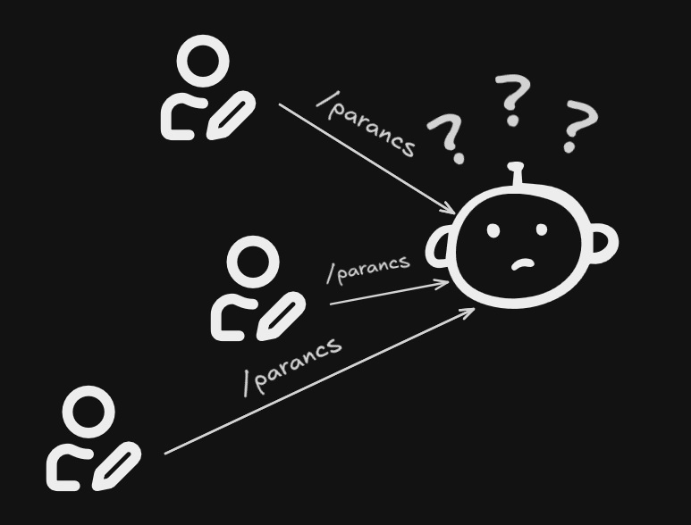
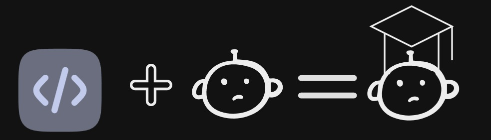
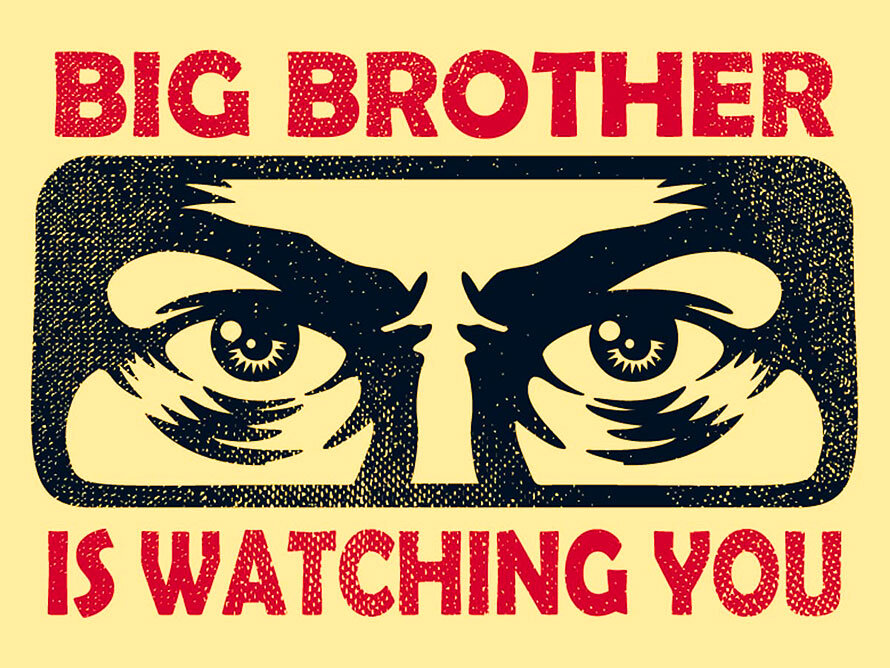
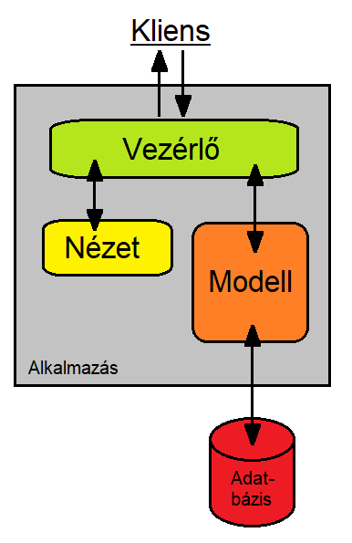
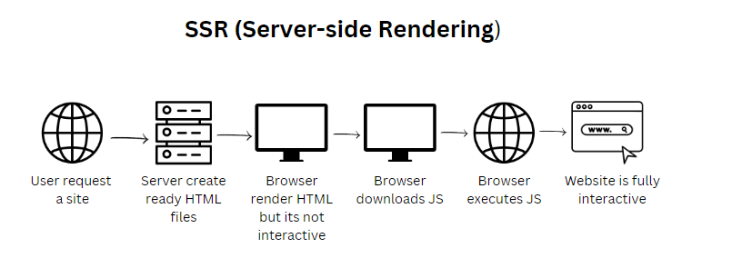

---
# You can also start simply with 'default'
theme: seriph
# random image from a curated Unsplash collection by Anthony
# like them? see https://unsplash.com/collections/94734566/slidev
layout: image
image: /assets/img/background.jpg
backgroundSize: cover
# some information about your slides (markdown enabled)
title: Discord bot és log program
# apply unocss classes to the current slide
class: text-center
# https://sli.dev/features/drawing
drawings:
  persist: false
# slide transition: https://sli.dev/guide/animations.html#slide-transitions
transition: slide-left
# enable MDC Syntax: https://sli.dev/features/mdc
mdc: true
---

  <h1 style="color: white">Discord bot és üzenet naplózó program</h1>

<h3 style="color: white">Mi fán terem a bot, és egyáltalán...</h3>

  Lássuk <carbon:arrow-right />

  <button @click="$slidev.nav.openInEditor" title="Open in Editor" class="slidev-icon-btn">
    <carbon:edit />
  </button>
  <a href="https://github.com/szankdav/SVSimulator-chatbot" target="_blank" class="slidev-icon-btn">
    <carbon:logo-github />
  </a>

---
transition: fade-out
---

## A projekt célja

Ez a projekt tanulási céllal jött létre, melynek eredményeképp megtudhatjuk mi az a discord bot, bepillantást nyerhetünk annak felépítésébe és működési logikájába. Megtanuljuk mi az az MVC pattern (modell-nézet-vezérlő programtervezési minta), amit követtünk a program létrehozása során, kis kitekintéssel az SQLite3 adatbázisra, és, hogy miért jó a SSR (server-side rendering). Végül megtudjuk, hogyan tudjuk használni a programot.

  
Induljunk, csak nehogy megBOToljunk <carbon:arrow-right />

  

  </img>

---
transition: slide-up
---

  <h1 style="color: white">Mi a Discord</h1>

A Discord egy ingyenes VoIP-alkalmazás amelyet legfőképp videójáték-közösségek számára terveztek, de nem zár ki más témájú közösséget sem.

Ha többet szeretnél tudni a Discord-ról, katt a képre!

  ...és mi a bot <carbon:arrow-right />

<!--
A Discordot úgy tervezték, hogy nagy rendszerigényű programok (leginkább videójátékok) futtatása mellett is gördülékenyen lehessen használni. A platform rendelkezik szöveges, kép- és videó-, valamint audiokommunikációval is. A Discord Windows, MacOS, Android, iOS, Linux operációs rendszereken és böngészőkön fut. A platformnak 2019. július 21-én több mint 250 millió felhasználója volt.
-->

---

  <h1 style="color: white">Discord bot</h1>

A Discordon található (ro)botok olyan alkalmazások, amelyek számos hasznos feladatot képesek automatikusan végrehajtani a szerveren.
Ebbe beletartozik bármi, amit az alkalmazás fejlesztője kódol a bot viselkedésébe. Lehet szó akár az új tagok fogadásáról, a "bajkeverők" kitiltásáról és a vita moderálásáról. Egyes botok még zenét vagy játékokat is hozzáadnak a szerverhez.

  
Úristen, hát ki tud ilyet létrehozni? <carbon:arrow-right />

<!--
A bot – a robot rövidítése, más néven internetes bot – olyan számítógépes program, amely egy felhasználó vagy más program "ügynökeként" működik, vagy emberi tevékenységet szimulál. A robotokat általában bizonyos feladatok automatizálására használják, ami azt jelenti, hogy az emberi utasítások nélkül is futhatnak.
-->

---

---

  <h1 style="color: white">És én!</h1>

Egyszóval bárki, akinek van egy alapszintű, de abból azért erős programozási tudása. Szerencsére az egyszerű, halandó embereknek nagyon jó (polkorrekt vagyok, nah) dokumentáció áll rendelkezésére:  
<a href="https://discordjs.guide/#before-you-begin" target="_blank">Hogyan készítsünk bot-ot</a>

 

A programban található bot is ennek a dokumentációnak a segítségével készült.  
A feladat nagyobbik részét leveszi a vállunkról a <a href="https://discord.com/developers/applications" target="_blank">Discord developer portal</a>, ahol létre kell hoznunk a botunkat, mint alkalmazást. Tehát valójában mi "csak" a létező bot-ot példányosítjuk, és csatlakoztatjuk a megfelelő szerverhez egy ID segítségével. A mi feladatunk a programunkban a bot viselkedésének programozása. 

  
Viselkedjél! <carbon:arrow-right />
 

---

  <h1 style="color: white">A bot "betanítása"</h1>

A botunk végeredményben egy chatbot, de mégsem az. Nem csak közvetlen kommunikáció útján képes parancsok végrehajtására. Én inkább úgy tekintek rá, mint egy automatizált asszisztens. A fejlesztés során mi programozzuk bele a "tudást", ami a különbőző parancsok végrehajtásához szükséges. 

  
Mit jelent az, hogy nem csak közvetlen kommunikáció útján képes a parancsok végrehajtására? <carbon:arrow-right />
 

<!--
Sok helyen AI chatbot-ként hivatkoznak a Discord botokra is, ami kicsit hamis kijelentés. Hacsak nem tápláltunk bele rengeteg információval rendelkező adatbázist, és készültünk fel mindenféle kérdés eshetőségére, vagy nem kötöttük össze őt egy másik chatbottal, például a ChatGPT-vel, (fun fact: a chatGPT nem más, mint egy baromi sok fehérjét ivott chatbot, ami értelmezőmodelleket használ, de ezt most itt bővebben nem fogom kifejteni) akkor a bot annyi parancsot lesz képes végrehajtani, és csak olyan válasszal, vagy tevékenységgel fog tudni szolgálni, amiket mi a programozás során megírtunk.
-->

---

  <h1 style="color: white">Mindig figyel...</h1>

A programunkban tehát mi "tanítjuk" meg a bot-nak, amit tudnia kell, és amit "csinálnia" kell. A fejlesztéshez a már említett csodálatosan átlátható és érthető (szarkazmus?) dokumentáció áll rendelkezésre:  
<a href="https://discordjs.guide/#before-you-begin" target="_blank">discord.js Guide</a>

 

A dokumentációban rengeten felhasználási lehetőségről olvashatunk, nekünk azonban kapóra jön egy, amivel képesek leszünk a háttérben, külön parancs kiadása nélkül naplózni a csatornán elküldött üzeneteket. A bot rendelkezik úgynevezett eseményfigyelővel, azaz listenerrel. Ezzel megadhatjuk, hogy a bot adott esemény beteljesülésekor milyen kódot futtasson, vagyis mit csináljon.

  
Összegezve<carbon:arrow-right />
 

  

<!--
A messageCreate eseményt figyelve, amikor egy üzenet elküldésre kerül a szerveren, a bot le fogja futtatni a kívánt kódot, automatikusan.
-->

---

  <h1 style="color: white">Eddig mit tudunk</h1>

 

A Discord egy multifunkcionális kommunikációs platform, ahol lehetőségünk van saját szerverek létrehozására, és ezeken a szervereken bot-ok futtatására, amik képesek ellátni különbőző, általunk megadott feladatokat.

 

Mi azt a célt tűztük ki, hogy az egyik ilyen feladata a botnak a szöveges üzenetek naplózása legyen.

 

  
A naplózás<carbon:arrow-right />
 

---

  <h1 style="color: white">A naplózó, a.k.a. logger program</h1>

 

A cél: 
Ha valaki üzenetet küld a szerveren, ahol a mindenható botunk figyel, ezt az üzenetet küldje tovább a bot egy programnak, ami eltárolja ezt az üzenetet és a hozzá tartozó, szükséges adatokat.

 

<ul>Azok a megvalósításhoz használt technológiák, amik bemutatása kerülnek:
  <li>MVC programtervezési minta</li>
  <li>SQLite3 az adatbázis kezeléséhez</li>
  <li>SSR, szerveroldali renderelés</li>
</ul>  

 

  
Haladjunk sorban<carbon:arrow-right />
 

<!-- 
Sok egyéb tech 
MVC: modell view controller, vagyis Modell-nézet-vezérlő minta 
SSR: server side rendering
 -->

---

  <h1 style="color: white">MVC programtervezési minta</h1>

 

A model-view-controller egyike a számos programtervezési mintának (design patterns). A programtervezési minták olyan újrafelhasználható megoldások, melyek gyakori problémákat oldanak meg. Nem konkrét kódot, implementiációt kell érteni alatta, hanem egy útmutatót (paradigmát), mely az adott probléma megoldására kínál egy bejáratott megoldást. Forrás: <a href="https://mernokinformatikus.hu/tervezesi-mintak-a-gyakorlatban/" target="_blank">Tervezési minták</a>

Az MVC elsősorban egy tervezési minta. Segítségével szétválaszthatjuk az adathoz, és a felhasználói felülethez tartozó dolgokat.

  
SQLite3<carbon:arrow-right />

   

<!-- 
A modell-nézet-vezérlő (MNV) (angolul model-view-controller) a szoftvertervezésben használatos programtervezési minta.[1] Gyakori fejlesztői kívánalom az adathoz (modell) és a felhasználói felülethez (nézet) tartozó dolgok szétválasztása, hogy a felhasználói felület ne befolyásolja az adatkezelést, és az adatok átszervezhetők legyenek a felhasználói felület változtatása nélkül. A modell-nézet-vezérlő ezt úgy éri el, hogy elkülöníti az adatok elérését és az üzleti logikát az adatok megjelenítésétől és a felhasználói interakciótól egy közbülső összetevő, a vezérlő (controller) bevezetésével.
 -->

---

  <h1 style="color: white">SQLite3</h1>

Az SQLite önálló, kis méretű (kb. 500 KiB), C forrású programkönyvtárként (library) megvalósított ACID-kompatibilis relációs adatbázis-kezelő rendszer, illetve adatbázismotor. Forrás: <a href="https://hu.wikipedia.org/wiki/SQLite" target="_blank">Wikipédia</a> 

Szóval mi is az SQLite3? (Érthetően) 
Az SQLite3 egy könnyűsúlyú adatbázis-kezelő rendszer. Ez azt jelenti, hogy nincs szükség külön szerverre, mert az egész adatbázis egyetlen fájlban tárolódik. A legtöbb programozási nyelv, köztük a Node.js és a Python, könnyen tud vele dolgozni.
 
<ul>Miért előnyös a használata?
  <li>Egyszerű használat – Nincs szükség bonyolult telepítésre vagy konfigurációra.</li>
  <li>Gyors – Kis méretű projektekhez és teszteléshez tökéletes.</li>
  <li>Nincs szükség szerverre – Az adatokat egy fájlban tárolja, így nem kell külön adatbázis-szervert futtatni.</li>
  <li>Platformfüggetlen – Bárhol működik (PC, mobil, IoT eszközök).</li>
  <li>ACID-kompatibilis – Az adatok konzisztenciája biztosított, ami azt jelenti, hogy megbízható tranzakciókat lehet vele végrehajtani.</li>
</ul>  

  
SSR<carbon:arrow-right />

<!-- 
ACID jelentése:
A – Atomicity (Atomi művelet)
Egy tranzakció vagy teljesen végrehajtódik, vagy egyáltalán nem.
Ha valami félbeszakad, az adatbázis nem maradhat „félig módosított” állapotban.
Példa: Ha egy banki átutalás során az összeg levonása sikerül, de a másik számlára nem érkezik meg, az adatbázis visszaáll az eredeti állapotra.
C – Consistency (Konzisztencia)
A tranzakció végrehajtása után az adatbázis érvényes és konzisztens állapotban marad.
Nem lehet érvénytelen vagy sérült adatot tárolni.
I – Isolation (Elszigeteltség)
Több tranzakció egymás mellett is futhat, de nem zavarhatják meg egymást.
Példa: Ha két ember egyszerre vásárol egy terméket, az adatbázis biztosítja, hogy csak az egyikük kapja meg, ha csak egy darab van raktáron.
D – Durability (Tartósság)
Ha egy tranzakció sikeresen végrehajtódik, az adat nem veszhet el még áramszünet vagy rendszerhiba esetén sem.
Miért fontos?
Az ACID tulajdonságok biztosítják, hogy az adatbázis megbízható és konzisztens marad, még akkor is, ha váratlan események történnek.
 -->

---

  <h1 style="color: white">SSR azaz Server-Side rendering</h1>

Az SSR (Server-Side Rendering, vagyis szerveroldali renderelés) egy technika, ahol a weboldal HTML kódja már a szerveren generálódik, és a böngésző egy teljesen előállított oldalt kap. 

<ul>Hogyan működik?
  <li>A felhasználó megnyit egy oldalt a böngészőben.</li>
  <li>A böngésző kérést küld a szervernek.</li>
  <li>A szerver összeállítja az oldal teljes HTML kódját (például adatbázisból lekért adatokkal).</li>
  <li>A böngésző megkapja az előre elkészített HTML-t, és megjeleníti az oldalt.</li>
</ul> 

 

  
A program<carbon:arrow-right />

<!-- 
Miért előnyös az SSR?
✅ Gyorsabb első betöltés – A felhasználók azonnal látják az oldalt, nem kell megvárni, hogy a JavaScript minden tartalmat betöltögessen.
✅ Jobb SEO (Keresőoptimalizálás) – A keresőmotorok könnyebben beolvassák a szerver által előállított HTML-t, mert az oldal tartalma azonnal elérhető.
✅ Jobb teljesítmény gyengébb eszközökön – Mivel a szerver végzi a számításokat, a böngészőnek kevesebb dolga van.
Mikor érdemes használni?

🔹 Ha SEO-barát weboldalt szeretnél (pl. blogok, híroldalak).
🔹 Ha a felhasználók gyorsan kell, hogy lássák az oldalt.
🔹 Ha sok dinamikus adatot kell megjeleníteni, de mégis gyorsan kell betölteni az oldalt.
SSR vs CSR (Client-Side Rendering)

    SSR: A szerver készíti el a HTML-t → Gyorsabb első betöltés, jobb SEO.
    CSR: A böngésző generálja a HTML-t (pl. React, Vue SPA-k) → Lassabb első betöltés, de gördülékenyebb interakciók. -->

---

  <h1 style="color: white">Let's LOG!</h1>

 

Most, hogy megismerkedtünk a discord botok világával, tudjuk mi az a MVC minta itt az ideje, hogy gyakorlatban is kipróbáljuk a tanultakat!

Töltsük le a programot, és használjuk, nézzük át a kódot és a hozzá tartozó dokumentációt, és értelmezzük!

A program forráskódja letölhető a GitHub-ról: 
https://github.com/szankdav/SVSimulator-chatbot

A readme.md fájl tartalmazza a szükséges lépéseket és információkat a futtatáshoz!

A program részletes dokumentációja a docs mappában elérhető!

Köszönöm, hogy velem tanultál!

